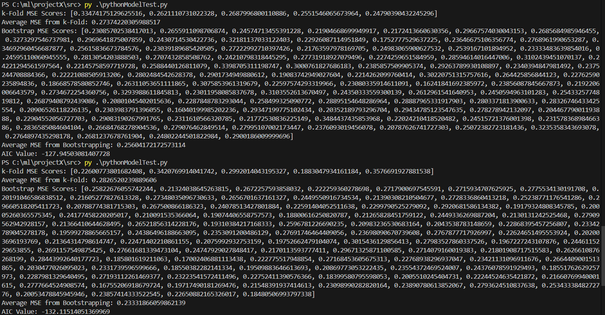

## TEAM NAME
ILYA

## TEAM
- Rakesh Reddy - A20525389
- Geeta Hade - A20580824
- Nishant Khandhar - A20581012
- Amogh Vastrad - A20588808

## Project Overview
In this project we have implemented generic k-fold cross-validation and bootstrapping methods for model selection,which test how well a model is likely to perform on new data. We have also included the Akaike Information Criterion (AIC) to compare models.This model evaluates the performance of regression models and compares it with the AIC.

## How to run the code

### Using a Notebook File

#### Prerequisites
- Install Python and required libraries: `numpy`, `matplotlib`. 

#### Steps to Execute
1. Open the terminal at the project folder.
2. Run the command: `jupyter notebook Project2.ipynb`
3. Run all cells sequentially.
4. View the model evaluation outputs (e.g., MSE scores, AIC values) and plots for insights into model performance and residuals.
5. It contains visualizations

### Using Python Class

#### Prerequisites
- Install Python and required libraries: `numpy`, `matplotlib`, `sklearn`.

#### Steps to Execute
1. Go to the `src` folder.
2. Execute the command: `python .\pythonModelTest.py`

## Outputs

1. **Cross-Validation:**
    - MSE Scores: [0.2473, 0.2475, 0.2448, 0.2401, 0.2326]
    - Average MSE: 0.2425

2. **Bootstrapping:**
    - MSE Scores (first 5): [0.2408, 0.2316, 0.2475, 0.2507, 0.2412]
    - Average MSE: 0.2397

3. **AIC:**
    - Value: -6247.93

4. **Visualizations:**
    - Residual distribution plot.
    - Error comparison across methods.
    - Bootstrapping confidence intervals.

## Key Questions and Answers

1. **Do Cross-Validation and Bootstrapping agree with AIC?**
    - Yes, all three methods largely agree in this implementation.
    - Example: Cross-validation and bootstrapping indicate a lower MSE for the selected model. AIC, with a low value (-6247.93), aligns with the performance metrics, confirming the model selection.

2. **In what cases might these methods fail?**
    - **Cross-Validation:** Fails for small datasets where splits lead to insufficient training data.
    - **Bootstrapping:** Assumes data is i.i.d.; fails for dependent datasets like time series.
    - **AIC:** Assumes normally distributed residuals; results may mislead for non-linear models.

3. **What could mitigate these issues?**
    - Implement stratified k-fold for imbalanced datasets.
    - Use block bootstrapping for dependent data.
    - Extend AIC to include models with corrected versions like AICc.

4. **What parameters are exposed?**
    - **Cross-Validation:** `k` (number of folds), default: 5.
    - **Bootstrapping:** `num_iterations` (default: 100), seed for reproducibility.
    - **Regression Models:** Regularization parameter `alpha` (for Ridge), default: 1.0.

## Additional Features
- Synthetic data generator for flexible testing.
- Residual analysis and visualization tools for insights.
- Extendable framework for adding new model selectors.

## Compatibility
- Tested on Windows
- Requires `numpy`, `matplotlib`, `Jupyter`, `sklearn`

## More data
- If you had time check the data folder for various plots and results
